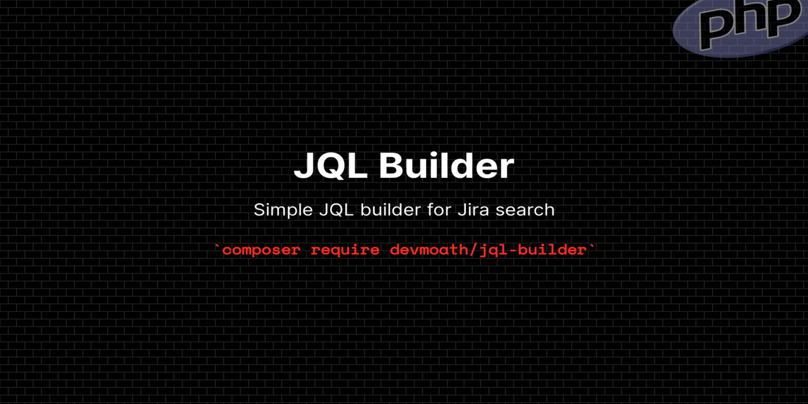

# Jql Builder

[](https://packagist.org/packages/devmoath/jql-builder)
[](https://packagist.org/packages/devmoath/jql-builder)
[](https://github.com/DevMoath/jql-builder/actions/workflows/tests.yml)
[](https://github.com/DevMoath/jql-builder/actions/workflows/phpstan.yml)
[](https://github.com/DevMoath/jql-builder/actions/workflows/php-cs-fixer.yml)

Simple JQL builder for Jira search

## Installation

```bash
composer require devmoath/jql-builder
```

## Usage

This is how to generate query:

```php
use JqlBuilder\Jql;

$builder = new Jql();

// Simple query
$query = $builder->where('project', '=', 'MY PROJECT')->getQuery();

echo $query; 
// 'project = "MY PROJECT"'

$builder = new Jql();

// Complex query
$query = $builder->where('project', '=', 'MY PROJECT')
    ->where('status', 'in', ['New', 'Done'])
    ->where('summary', '~', 'sub-issue for "TES-xxx"')
    ->where('labels', '=', 'support')
    ->when(false, fn (Jql $builder, mixed $value) => $builder->where('creator', '=', 'admin'))
    ->when(true, fn (Jql $builder, mixed $value) => $builder->where('creator', '=', 'guest'))
    ->orderBy('created', 'asc')
    ->getQuery();

echo $query; 
// 'project = "MY PROJECT" and status in ("New", "Done") and summary ~ "sub-issue for \"TES-xxx\"" and labels = "support" and creator = "guest" order by created asc'
```

Also, you can add macro functions as well to encapsulate your logic:

```php
use JqlBuilder\Jql;

$builder = new Jql();

$builder::macro('whereCustom', function (mixed $value) {
    /** @var Jql $this */
    return $this->where('custom', '=', $value);
});

$query = $builder->whereCustom('1')->getQuery();

echo $query;
// 'custom = "1"'
```

## Testing

```bash
composer test
```

## Changelog

Please see [CHANGELOG](CHANGELOG.md) for more information on what has changed recently.

## Credits

- [Moath](https://github.com/devmoath)
- [All Contributors](https://github.com/DevMoath/jql-builder/graphs/contributors)

## License

The MIT License (MIT). Please see [License File](LICENSE.md) for more information.
