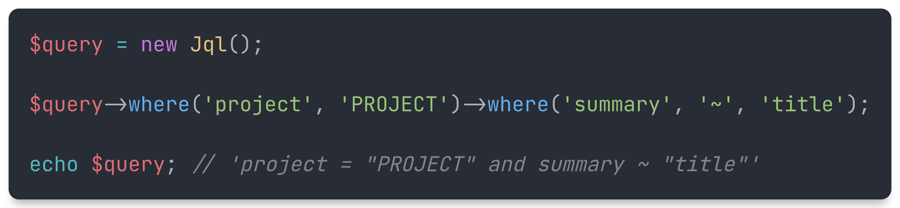

<p align="center">
    
</p>

<p align="center">
    <a href="https://github.com/devmoath/jql-builder/actions"></a>
    <a href="https://packagist.org/packages/devmoath/jql-builder"></a>
    <a href="https://packagist.org/packages/devmoath/jql-builder"></a>
    <a href="https://packagist.org/packages/devmoath/jql-builder"></a>
</p>

**JQL builder** is a supercharged PHP package that allows you to
create [Jira Query Language (JQL)](https://www.atlassian.com/software/jira/guides/expand-jira/jql).

## Get Started

> **Requires [PHP 8.0+](https://php.net/releases/)**

First, install `devmoath/jql-builder` via the [Composer](https://getcomposer.org/) package manager:

```bash
composer require devmoath/jql-builder
```

Then, interact with JQL builder:

```php
$query = new Jql();

$query->where('project', 'PROJECT')->where('summary', '~', 'title');

echo $query; // 'project = "PROJECT" and summary ~ "title"'
```

## Usage

This is how to generate query:

```php
use JqlBuilder\Jql;

$builder = new Jql();

// Simple query
$query = $builder->where('project', 'MY PROJECT')->getQuery();

echo $query;
// 'project = "MY PROJECT"'

$builder = new Jql();

// Complex query
$query = $builder->where('project', 'MY PROJECT')
    ->where('status', ['New', 'Done'])
    ->orWhere('summary', '~', 'sub-issue for "TES-xxx"')
    ->orWhere('labels', 'support')
    ->when(false, fn (Jql $builder, mixed $value) => $builder->where('creator', 'admin'))
    ->when(true, fn (Jql $builder, mixed $value) => $builder->where('creator', 'guest'))
    ->orderBy('created', 'asc')
    ->getQuery();

echo $query;
// 'project = "MY PROJECT" and status in ("New", "Done") or summary ~ "sub-issue for \"TES-xxx\"" or labels = "support" and creator = "guest" order by created asc'
```

Also, you can add macro functions as well to encapsulate your logic:

```php
use JqlBuilder\Jql;

$builder = new Jql();

$builder::macro('whereCustom', function (mixed $value) {
    /*
     * your code...
     */
    
    /** @var Jql $this */
    return $this->where('custom', $value);
});

$query = $builder->whereCustom('1')->getQuery();

echo $query;
// 'custom = "1"'
```

laravel facade support out of the box:

```php
use JqlBuilder\Facades\Jql;

$query = Jql::where('summary', '=', 'value')->getQuery();

echo $query;
// 'summary = "value"'
```

## Contributing

Thank you for considering contributing to the JQL Builder! The contribution guide can be found in the [CONTRIBUTING](CONTRIBUTING.md).

## Security Vulnerabilities

If you discover any security-related issues, please email moath.alhajrii@gmail.com instead of using the issue tracker.

## License

JQL builder is an open-sourced software licensed under the **[MIT license](https://opensource.org/licenses/MIT)**.
